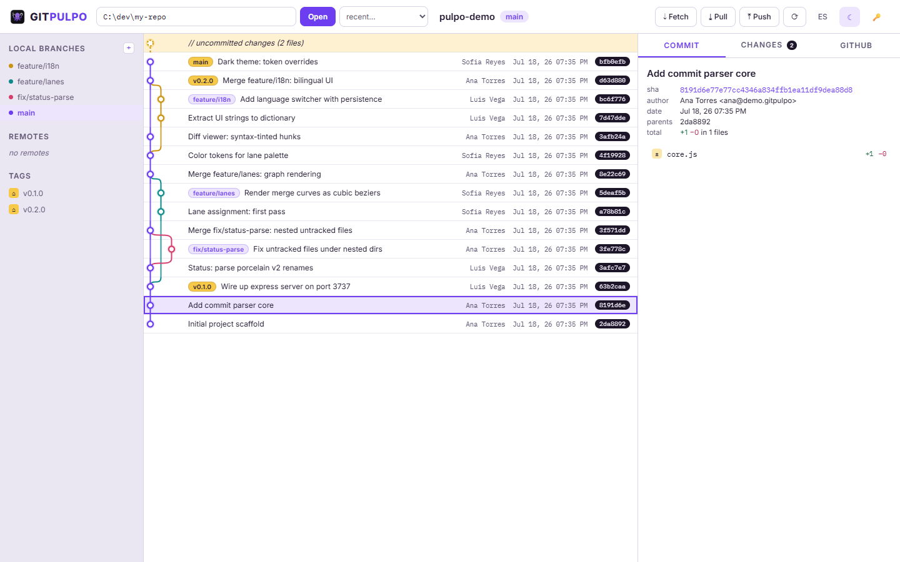

<p align="center">
  <picture>
    <source media="(prefers-color-scheme: dark)" srcset="public/logo/gitpulpo-dark.png">
    
  </picture>
</p>

# 🐙 GitPulpo

**Multitasking your repos.** Local Git repository visualizer with a GitKraken-style commit graph, staging area, and GitHub integration — a small Express app rendered in your browser. No Electron, no build step, one dependency.

## Screenshots

<picture>
  <source media="(prefers-color-scheme: dark)" srcset="docs/screenshot-dark.png">
  
</picture>

*Commit graph with colored lanes, ref chips, tags, the uncommitted-changes row, and the detail panel. The screenshot follows your GitHub theme; both light and dark ship built in.*

## Features

- **Commit graph** — topological, color-coded lanes for all branches, merge curves, ref/tag/HEAD chips, and a dotted WIP row when you have uncommitted changes.
- **Commit detail** — metadata, per-file +/− stats, colorized diffs (click a file to expand).
- **Staging / WIP** — stage, unstage, and discard per file or all at once; inline diffs (including untracked files); commit from the browser.
- **Branches** — create (+ button), checkout with double-click, click to center the graph on a branch; remote branches and tags in the sidebar.
- **Remote actions** — fetch, pull (`--ff-only` only, never surprise merges), push, ahead/behind indicator.
- **GitHub tab** — if `origin` points to github.com: repo metadata, pull requests, and issues with open/closed/all filters. Optional token (🔑 button) raises the API rate limit from 60 to 5000 req/h.
- **Recent repos** — remembers the last 10 repositories you opened.
- **Bilingual UI** — Spanish and English with a one-click runtime switcher; your choice persists.
- **Light & dark themes** — token-based theming that follows your OS preference, with a manual toggle. Both themes pass WCAG AA contrast.

## Requirements

- Node.js **18+** (uses the global `fetch`)
- `git` available on your `PATH`

## Getting started

```bash
git clone https://github.com/corymotiongit/gitpulpo.git
cd gitpulpo
npm install
npm start
```

Open http://localhost:3737 and paste the path of any local Git repository.

To use a different port: `PORT=4000 npm start` (PowerShell: `$env:PORT=4000; npm start`).

## Architecture

```
server.js        Express, listens on 127.0.0.1 only
lib/git.js       git CLI wrapper (execFile, no shell)
lib/github.js    GitHub API client + config at ~/.gitpulpo.json
public/graph.js  lane-assignment algorithm + per-row SVG rendering
public/app.js    UI logic (vanilla JS, no build step)
public/i18n.js   ES/EN string dictionary + runtime language switcher
public/theme.js  light/dark theme bootstrap (pre-CSS, no flash)
public/*.css/html
```

No database: everything comes live from `git log/status/show`.

## GitHub token (optional)

- Use a **fine-grained token** with read-only access to the repos you need — nothing more.
- The token is stored **in plain text** at `~/.gitpulpo.json`. Anyone with access to your user profile can read it. Revoke it from GitHub settings if in doubt.

## Security model

GitPulpo executes real `git` commands on your machine, so it is deliberately conservative:

- Binds to `127.0.0.1` only — never exposed to your network.
- Validates the `Host` header to block DNS-rebinding attacks from malicious websites.
- All git invocations use `execFile` (no shell), refs are validated against an allowlist pattern, and file previews are confined to the repository directory.

**Do not** change the bind address to expose it on a network: there is no authentication, and anyone who can reach the port can operate on your repositories and read your stored token.

## Roadmap

- Stash, merge, amend, force branch delete
- Auto-refresh on filesystem changes
- Log pagination beyond 500 commits
- `npx gitpulpo` launcher

## License

[MIT](LICENSE)
